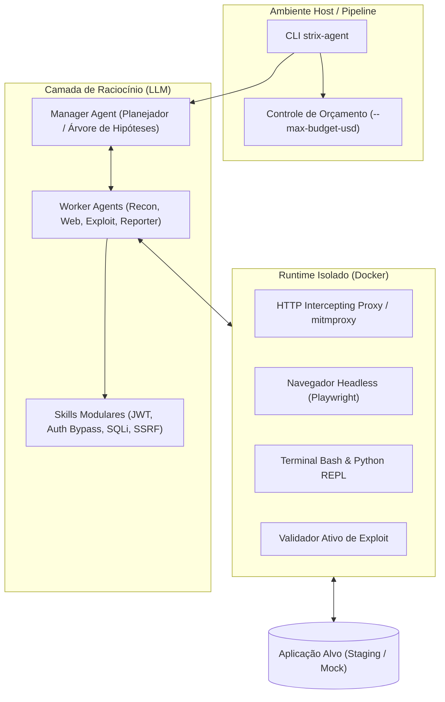

# Strix — Pentest Autônomo e Validação Dinâmica de Segurança por IA

## 📌 Resumo

O **Strix** (`usestrix/strix`, pacote `strix-agent`) é um framework open-source licenciado sob **Apache-2.0** que automatiza testes de intrusão (penetration testing) e validação de segurança em aplicações web e APIs através de um grafo coordenado de agentes de IA (*Coordination Graph*).

Diferente de scanners estáticos (SAST) como o [[semgrep-guardian]] ou scanners dinâmicos (DAST) baseados em regras rígidas como ZAP e Nuclei, o Strix raciocina sobre a superfície da aplicação, encadeia ações de exploração ativas em um sandbox Docker isolado e só confirma vulnerabilidades mediante a geração de um **Proof-of-Concept (PoC)** reproduzível.

No [[adocao-de-ferramenta]], o Strix é classificado como **Camada de Diagnóstico Profundo em Staging / P2 (Piloto Controlado)**: não substitui o SAST de custo zero no loop do dev, mas atua como guardrail pré-release para encontrar falhas de lógica de negócio e permissões (IDOR/BOLA).

---

## 🧠 1. Arquitetura e Mecânica Interna

O Strix opera em uma estrutura desacoplada em três camadas:



1. **Coordination Graph (Manager & Workers):**
   * **Manager Agent:** Atua como o cérebro tático. Mapeia a tecnologia do alvo, decompõe o objetivo em tarefas menores e ajusta a estratégia dinamicamente baseado nos retornos HTTP.
   * **Worker Agents:** Agentes especializados que executam tarefas de reconhecimento de rotas, manipulação de sessões com browser headless (Playwright), geração de payloads e escrita de scripts Python dedicados.
2. **Docker Execution Sandbox:**
   * Todos os testes ativos rodam dentro de um contêiner Docker isolado gerenciado pelo CLI. O agente tem acesso a um terminal com utilitários de rede, proxy de interceptação e runtime Python para programar e disparar ataques sem poluir a máquina host.
3. **Validação Ativa via PoC (Falsos Positivos ~ 0%):**
   * Uma vulnerabilidade só é reportada se o agente conseguir demonstrar o impacto prático (ex.: exfiltração de dado de outro usuário, bypass comprovado de autenticação ou execução remota).
4. **Ciclo de Remediação Automática:**
   * Quando o código-fonte local é fornecido, o Strix pode sugerir patches (`diff`) e re-executar os testes contra o contêiner de desenvolvimento para validar se a falha foi extinta sem quebrar a aplicação.

---

## 🛠️ 2. Como Configurar e Usar

### Pré-requisitos
* **Docker** instalado e em execução no host.
* **Python 3.12+**.
* Chave de API de um provedor de LLM compatível (Anthropic Claude 3.5/3.7 Sonnet ou OpenAI GPT-4o recomendados).

### Instalação
```bash
# Via pip oficial
pip install strix-agent

# Ou via instalador oficial
curl -sSL https://strix.ai/install | bash
```

### Configuração de Ambiente
```bash
export STRIX_LLM="anthropic/claude-3-7-sonnet"
export LLM_API_KEY="sk-ant-..."
```
*(A configuração persistirá automaticamente em `~/.strix/cli-config.json` após a primeira execução).*

### Comandos Principais

```bash
# 1. Varredura com teto orçamentário estrito (essencial para evitar surpresas financeiras)
strix --target http://localhost:3000 --max-budget-usd 5.00

# 2. Varredura com foco específico via prompt
strix --target http://localhost:3000 --instruction "Foque exclusivamente em falhas de controle de acesso IDOR/BOLA nas rotas /api/v1/users"

# 3. Varredura incremental de Pull Request no CI/CD (apenas código alterado)
strix --target ./ --scope-mode diff --max-budget-usd 3.00
```

---

## 🎯 3. Quando Usar (Cenários Ideais)

* **Validação Pré-Release em Ambientes de Staging:** Executar varreduras antes de deploys principais para validar superfícies expostas e fluxos de permissão complexos.
* **Detecção de Falhas de Lógica de Negócio (IDOR / BOLA / Broken Auth):** Cenários onde scanners estáticos e DAST tradicionais falham por não compreenderem o estado e a semântica da aplicação.
* **Scan Incremental em PRs de Alto Risco:** Disparo automático em branches que alteram camadas críticas (autenticação, permissões Supabase RLS, webhooks, pagamentos).
* **Apoio e Aceleração de AppSec / Red Team:** Mapeamento preliminar de superfície de ataque e geração automatizada de relatórios técnicos e PoCs.

---

## ⚠️ 4. Quando NÃO Usar & Limitações Críticas

1. **PROIBIDO em Ambientes de Produção com Dados Reais:**
   * O Strix realiza **ataques ativos e injeções reais** (mutação de registros via POST/PUT/DELETE, tentativas de bypass). Usar em produção pode corromper dados, estourar cotas de terceiros ou disparar webhooks financeiros reais.
2. **Pipelines de CI/CD Rápidos (< 5 minutos):**
   * A inferência multiagente e a exploração dinâmica levam de 8 a 45 minutos. Não deve bloquear o ciclo comum de push de commits de desenvolvimento.
3. **Aplicações sob WAF Rígido sem Whitelist:**
   * Serviços como Cloudflare ou AWS WAF bloquearão os IPs dos agentes por rate-limit. O LLM interpretará retornos HTTP `403/429` incorretamente, gerando alucinações e desperdício de tokens.
4. **Sistemas Legados Frágeis:**
   * APIs monolíticas sem isolamento de banco ou sem idempotência podem travar ou entrar em deadlock sob fuzzing simultâneo dos agentes.

---

## ⚖️ 5. Benefícios Reais vs Riscos & Cuidados

| Dimensão | Benefício Real | Risco / Cuidado Obrigatório |
| :--- | :--- | :--- |
| **Assertividade** | Falsos positivos reduzidos a quase zero devido à obrigatoriedade de PoC executável. | Falsos negativos em fluxos que exigem MFA, autenticações corporativas (SSO/SAML) ou WebSockets. |
| **Custo Financeiro** | Muito mais barato que contratar consultoria humana de pentest para cada release. | **Consumo explosivo de tokens:** Sem `--max-budget-usd`, um scan complexo pode ultrapassar facilmente $50-$100 em chamadas de API. |
| **Isolamento** | Execução encapsulada em Docker sandbox, evitando scripts arbitrários soltos no host. | Exige acesso ao socket do Docker (`/var/run/docker.sock`), o que demanda cuidados de segurança em runners de CI/CD. |
| **Determinismo** | Capacidade de raciocinar e adaptar payloads conforme respostas dinâmicas do servidor. | Não-determinismo de LLM: duas execuções seguidas podem seguir caminhos táticos diferentes. |

---

## 🎯 6. Impacto nos Produtos da Async Studio

* **[[app-encaixe]]**: Validação profunda em staging das políticas RLS no Supabase e isolamento de tenants (garantir que cliente A não acesse a agenda ou dados sensíveis do cliente B).
* **[[app-asynchub]]**: Testes em APIs de ingestão e rotas de administração para assegurar que tokens de serviço e roles de usuários não sofram escalada de privilégios.
* **[[site-institucional]]**: Auditoria de formulários e Server Actions do Next.js para prevenção de SSRF e injeções em integrações externas (Resend/CRM).

---

## 🔗 Ver também

* [[adocao-de-ferramenta]] — portão de decisão técnica e avaliação de custos de ferramentas.
* [[semgrep-guardian]] — análise estática de segurança (SAST) em tempo real no loop de código.
* [[qualidade-automatizada]] — testes determinísticos de regressão (Playwright e Vitest).
* [[clean-code]] — padrões de arquitetura limpa e sustentabilidade de software.
