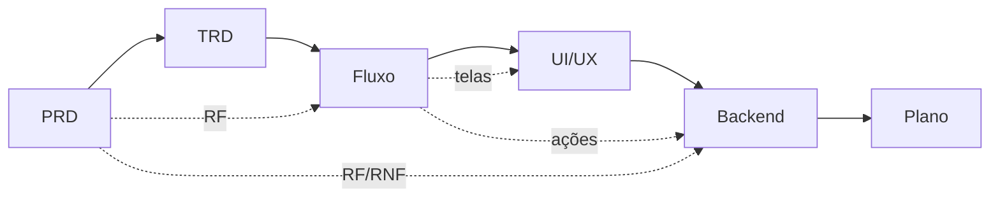

# Fluxo de construção de projetos — os 6 documentos

## 📌 Resumo

Todo projeto de porte substancial começa por seis documentos, escritos **um de cada vez** e aprovados por mim antes do próximo. Eles servem a dois leitores: a IA, que precisa de contexto estável entre sessões para não reinventar decisões, e eu, que preciso entender e decidir o que está sendo construído. O método executável está na skill [fluxo-de-projeto](../ia/agentes/skills/fluxo-de-projeto/SKILL.md); os templates, em `references/` da mesma skill.

> 💡 **Analogia:** planta de casa. O PRD é o programa de necessidades ("três quartos, um home office"); o TRD é a escolha de estrutura e materiais; o Fluxo é a circulação entre cômodos; o UI/UX é o acabamento; o Backend é a fundação e a parte hidráulica; o Plano é o cronograma da obra. Mudar a fundação depois de levantar a parede custa caro — por isso a ordem.

## 🧠 Conceitos principais

### 1. Cada documento responde uma pergunta

| # | Documento | Pergunta que responde | Maior risco se faltar |
| :-: | :--- | :--- | :--- |
| 1 | PRD | O quê e por quê? | Construir a solução certa para o problema errado |
| 2 | TRD | Com o quê e sob quais restrições? | Stack decidida por gosto, a cada sessão |
| 3 | Fluxo do app | Por onde o usuário anda? | Só o caminho feliz implementado |
| 4 | UI/UX Design | Como parece e responde? | Interface genérica e inconsistente |
| 5 | Esquema backend | Que dado existe e quem acessa? | Vazamento entre usuários; modelo impossível de mudar |
| 6 | Plano | Em que ordem, em pedaços de que tamanho? | Tarefa grande demais para revisar; nada demonstrável até o fim |

### 2. A ordem é uma cadeia de dependência

IDs amarram tudo: `RF-01` nasce no PRD, aparece num fluxo (`FLX-02`), numa tela (`TELA-03`), numa tabela e numa tarefa (`T-07`). Qualquer item sem origem é escopo inventado. No fim, a skill `spec-compliance` audita o código contra os mesmos IDs.

### 3. Portão humano entre documentos

A IA escreve com a mesma confiança quando acerta e quando inventa. Um erro no PRD, se não for pego ali, é copiado para os cinco documentos seguintes e depois para o código. Revisar cada documento isolado, com o checklist do topo, é mais barato do que revisar os seis juntos — e é onde **eu** aprendo o projeto, em vez de só aprovar o que a IA produziu.

## ⚠️ Erros comuns

- **Gerar os seis de uma vez.** Parece produtivo; na prática ninguém revisa 40 páginas, e o erro do primeiro contamina o resto.
- **Aplicar em tudo.** Landing page não precisa de TRD. O portão de porte da skill decide quantos documentos o projeto merece.
- **Documento que não acompanha o código.** Mudou a decisão na implementação → atualiza o documento de origem primeiro. Doc desatualizado é pior que nenhum, porque o próximo agente obedece.
- **Aprovar sem ler o checklist.** O bloco "Revisão humana" lista justamente o que a IA mais erra naquele tipo de documento.

## ✅ Como aplicar na prática

1. No repositório novo, peça ao agente: "vamos começar o projeto X" — a skill `fluxo-de-projeto` dispara e decide o porte.
2. Responda as perguntas do PRD; revise com o checklist; aprove.
3. Repita documento a documento. Os arquivos ficam em `docs/` do projeto.
4. Com o Plano aprovado, o agente executa uma tarefa `T-NN` por vez.
5. Ao fechar o MVP, rode `spec-compliance` contra o PRD.

## 🔗 Ver também

- Skill [levantamento-requisitos](../ia/agentes/skills/levantamento-requisitos/SKILL.md) alimenta o PRD · skill [decisao-arquitetural](../ia/agentes/skills/decisao-arquitetural/SKILL.md) registra as escolhas do TRD como ADR
- [[adocao-de-ferramenta]] — portão para qualquer dependência nova citada no TRD
- [[fluxo-issue-pr]] — como as tarefas do Plano viram issue, branch e PR
- [[spec-to-code-compliance]] — auditoria final contra o PRD

## 📚 Fontes

- Estrutura dos 6 documentos: definida pelo Murilo (2026-09); inspirada na prática comum de "context engineering" para desenvolvimento com agentes de IA.
- Rastreabilidade por ID e auditoria spec → código: método da Trail of Bits, ver [[spec-to-code-compliance]].
