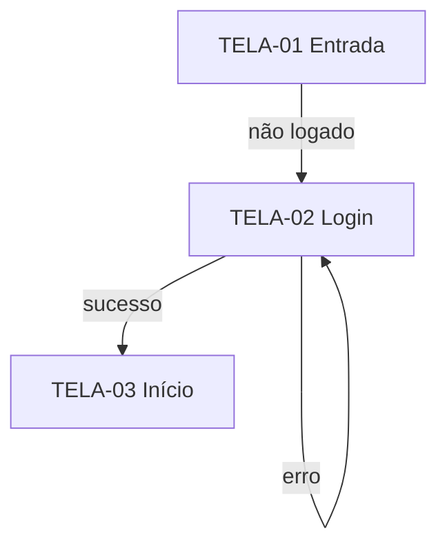

# 02 · Fluxo do app — {{nome do projeto}}

> [!NOTE]
> **Sobre este documento — leia antes de preencher ou revisar**
>
> **O que é:** o mapa de como o usuário se move pelo app — telas, caminhos, decisões, estados e erros — descrito como comportamento, sem nada visual.
>
> **Para que serve:** é a ponte entre **o que** (PRD), **como aparece** (UI/UX) e **que dado precisa** (Backend). É aqui que aparecem os caminhos esquecidos: erro, lista vazia, sem permissão, cancelar, voltar. A IA tende a implementar só o caminho feliz; este documento obriga os outros.
>
> **Vem de:** [PRD](01-prd.md) (cada RF vira pelo menos um fluxo). · **Alimenta:** [TRD](03-trd.md) (os fluxos revelam o que a tecnologia precisa suportar: tempo real, notificação, upload, offline, pagamento), UI/UX (inventário de telas), Backend (cada ação lê ou grava algo), Plano.
>
> **Por que vem antes do TRD:** o fluxo não depende de tecnologia, mas a escolha de tecnologia depende do fluxo. Decidir a stack antes de saber que o app precisa de notificação em tempo real é escolher no escuro.
>
> **Não entra aqui:** tecnologia e biblioteca (TRD); cor, tamanho, componente visual (UI/UX); tabela e endpoint (Backend).

> [!IMPORTANT]
> **Revisão humana — confira antes de aprovar**
>
> - [ ] **Todo RF do PRD** aparece em pelo menos um fluxo — e **todo fluxo** aponta para um RF (senão é escopo inventado).
> - [ ] Cada fluxo tem **caminho de erro, vazio e cancelamento**, não só o feliz.
> - [ ] Percorri o mapa **como usuário real**: consigo chegar a cada tela e sair dela? Não há beco sem saída?
> - [ ] **Primeiro uso** (cadastro, onboarding, tudo vazio) está coberto.
> - [ ] Está claro o que acontece quando alguém **sem permissão** tenta acessar.
> - [ ] A **tarefa principal** do produto tem o menor número de passos possível — contei os cliques.
>
> **Sinais de alerta:** tela que aparece no diagrama e não no inventário (ou vice-versa); fluxo sem estado de erro; "o usuário faz login" sem dizer o que acontece se errar a senha.

## 🎯 Decisões críticas para validar

> [!WARNING]
> **Preenchido pela IA, respondido por você.** De 1 a 5 pontos deste documento em que um erro agora custa caro depois — porque é difícil de reverter, porque se espalha pelos documentos seguintes ou porque se apoia em hipótese não confirmada. Ponto óbvio não entra. **O documento só é aprovado quando todas as linhas tiverem sua resposta.**
>
> _Onde costumam estar neste documento: a jornada da tarefa principal · papéis e permissões · primeiro uso · o que acontece quando algo dá errado no fluxo central._

| # | Decisão ou suposição | Por que pesa no futuro | Se estiver errada… | Recomendação da IA | Sua resposta |
| :-: | :--- | :--- | :--- | :--- | :--- |
| 1 | | | | | ⬜ confirmo · ✏️ ajusto: … |

---

## 1. Inventário de telas

| ID | Tela | Propósito | Acesso (público / logado / papel) | RFs |
| :--- | :--- | :--- | :--- | :--- |
| TELA-01 | | | | RF-01 |

## 2. Mapa de navegação

## 3. Fluxos

### FLX-01 — {{nome do fluxo}}

- **Cobre:** RF-01
- **Ator:**
- **Gatilho:** _o que inicia o fluxo._
- **Pré-condição:** _o que precisa ser verdade antes._
- **Caminho principal:**
  1. …
  2. …
- **Caminhos alternativos e erros:**
  - _Se X → o sistema faz Y e o usuário vê Z._
- **Resultado:** _o que mudou no sistema ao final._

## 4. Estados globais

| Estado | Quando acontece | O que o usuário vê / pode fazer |
| :--- | :--- | :--- |
| Carregando | | |
| Vazio (primeiro uso) | | |
| Erro de rede / servidor | | |
| Sessão expirada | | |
| Sem permissão | | |

## 5. Permissões por papel

| Ação | Visitante | Usuário | Admin |
| :--- | :---: | :---: | :---: |
| | | | |

## 6. Eventos e notificações

| Evento | Quem é avisado | Canal desejado (e-mail, push, in-app) | FLX |
| :--- | :--- | :--- | :--- |
| | | | |

## 7. Necessidades técnicas reveladas (entrada para o TRD)

_Tudo que os fluxos exigem e que a tecnologia terá de suportar. Não escolher a solução aqui — só registrar a necessidade._

| Necessidade | Fluxo de origem | Exemplo concreto |
| :--- | :--- | :--- |
| _ex.: atualização em tempo real_ | FLX-03 | _o profissional vê o encaixe aparecer sem recarregar_ |

## 8. Perguntas em aberto

- [ ]

## 9. Registro de mudanças

| Versão | Data | Mudança | Motivo |
| :--- | :--- | :--- | :--- |
| 0.1 | | Primeira versão | |
