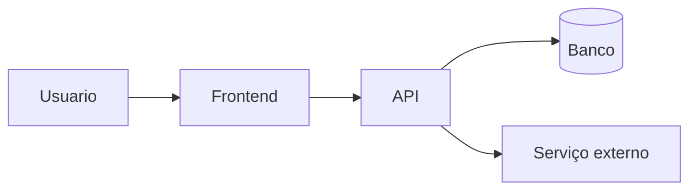

# 03 · TRD — {{nome do projeto}}

> [!NOTE]
> **Sobre este documento — leia antes de preencher ou revisar**
>
> **O que é:** o *Technical Requirements Document* traduz o PRD em decisões técnicas: stack, arquitetura de alto nível, integrações, segurança e como cada requisito não funcional será atendido.
>
> **Para que serve:** fixar **com o quê** e **sob quais restrições** o sistema será construído, antes do código. Sem ele, cada sessão com a IA reescolhe biblioteca e padrão por gosto, e o projeto vira uma colcha de retalhos.
>
> **Vem de:** [PRD](01-prd.md) (principalmente os RNF) e [Fluxo do app](02-fluxo-do-app.md) (seção *Necessidades técnicas reveladas*), ambos aprovados. · **Alimenta:** UI/UX (biblioteca de componentes), Backend (banco, auth), Plano (setup).
>
> **Não entra aqui:** campos de tabela (Backend), telas (UI/UX), ordem de tarefas (Plano).

> [!IMPORTANT]
> **Revisão humana — confira antes de aprovar**
>
> - [ ] Cada escolha de stack tem **justificativa ligada a um requisito ou restrição real** — não "porque é moderno".
> - [ ] Está alinhado à minha **stack padrão**? Todo desvio foi justificado?
> - [ ] Toda **dependência ou serviço novo** responde: por que é necessário, qual a alternativa sem ela, quanto custa manter.
> - [ ] **Custos e limites** de free tier estão escritos — e sei o que acontece quando estourar.
> - [ ] **Versões** foram conferidas na documentação atual, não tiradas da memória da IA.
> - [ ] **Segurança:** sei onde ficam os segredos, como é a autenticação, quem autoriza o quê, e como tratamos dado pessoal (LGPD).
> - [ ] Todo **RNF-NN** do PRD tem uma estratégia técnica e uma forma de validar aqui.
> - [ ] Toda **necessidade técnica** listada no Fluxo (tempo real, upload, notificação, offline…) tem resposta aqui.
> - [ ] Decisões **difíceis de reverter** viraram ADR (skill `decisao-arquitetural`).
>
> **Sinais de alerta:** microsserviço, fila, Kubernetes ou cache num MVP sem tráfego; biblioteca que eu nunca ouvi falar; dois serviços fazendo a mesma coisa (ex.: dois provedores de auth).

## 🎯 Decisões críticas para validar

> [!WARNING]
> **Preenchido pela IA, respondido por você.** De 1 a 5 pontos deste documento em que um erro agora custa caro depois — porque é difícil de reverter, porque se espalha pelos documentos seguintes ou porque se apoia em hipótese não confirmada. Ponto óbvio não entra. **O documento só é aprovado quando todas as linhas tiverem sua resposta.**
>
> _Onde costumam estar neste documento: banco e BaaS · provedor de autenticação · hospedagem e dependência de fornecedor (lock-in) · custo quando sair do free tier._

| # | Decisão ou suposição | Por que pesa no futuro | Se estiver errada… | Recomendação da IA | Sua resposta |
| :-: | :--- | :--- | :--- | :--- | :--- |
| 1 | | | | | ⬜ confirmo · ✏️ ajusto: … |

---

## 1. Visão técnica

_Três a cinco linhas: tipo de aplicação (web, mobile, API), onde roda, como as partes conversam._

## 2. Stack

| Camada | Escolha | Versão | Por quê (requisito/restrição) | Alternativa descartada |
| :--- | :--- | :--- | :--- | :--- |
| Front-end | | | | |
| Back-end / BaaS | | | | |
| Banco de dados | | | | |
| Autenticação | | | | |
| Hospedagem / deploy | | | | |
| Observabilidade | | | | |

## 3. Arquitetura de alto nível

_Explique em prosa o que o diagrama não mostra: onde roda a lógica de negócio, o que é síncrono e o que é assíncrono._

## 4. Integrações externas

| Serviço | Para quê | Autenticação | Limites / custo | O que acontece se cair |
| :--- | :--- | :--- | :--- | :--- |
| | | | | |

## 5. Atendimento dos requisitos não funcionais e das necessidades do Fluxo

| Origem (RNF-NN ou necessidade do Fluxo) | Estratégia técnica | Como validar |
| :--- | :--- | :--- |
| RNF-01 | | |

## 6. Segurança e privacidade

- **Segredos:** _onde ficam (variável de ambiente, cofre) — nunca no código._
- **Autenticação:**
- **Autorização:** _modelo de papéis; detalhe fica no Backend._
- **Dados pessoais (LGPD):** _quais, base legal, retenção._

## 7. Ambientes e deploy

| Ambiente | Onde | Como faz deploy | Dados |
| :--- | :--- | :--- | :--- |
| Local | | | |
| Produção | | | |

## 8. Observabilidade

_Erros, logs e métricas: ferramenta e o que é monitorado._

## 9. Decisões registradas (ADRs)

- _ADR-NNN — decisão — link._

## 10. Riscos técnicos

| Risco | Probabilidade | Impacto | Mitigação |
| :--- | :--- | :--- | :--- |
| | | | |

## 11. Perguntas em aberto

- [ ]

## 12. Registro de mudanças

| Versão | Data | Mudança | Motivo |
| :--- | :--- | :--- | :--- |
| 0.1 | | Primeira versão | |
