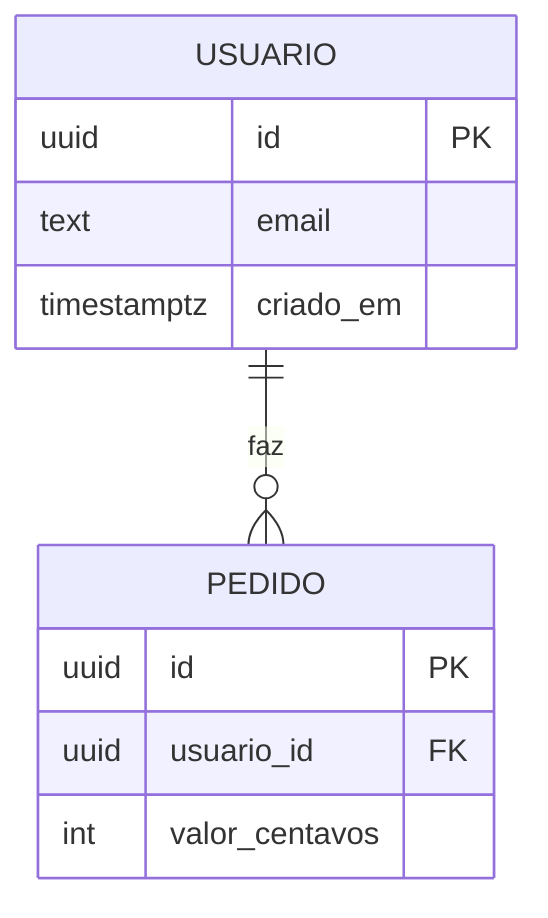

# 05 · Esquema backend — {{nome do projeto}}

> [!NOTE]
> **Sobre este documento — leia antes de preencher ou revisar**
>
> **O que é:** o modelo de dados (entidades, campos, relações), as regras de acesso (quem lê e grava o quê — RLS/autorização), os contratos de API/funções de servidor e os processos em segundo plano (jobs, webhooks).
>
> **Para que serve:** dado é a parte **mais cara de mudar depois** — uma tabela mal modelada contamina todo o resto. E é aqui que moram as falhas de segurança mais graves (um usuário vendo dado de outro). Fixar antes impede a IA de criar uma tabela nova a cada feature.
>
> **Vem de:** [PRD](01-prd.md) (entidades citadas nos RF), [Fluxo](02-fluxo-do-app.md) (cada ação lê ou grava algo) e [TRD](03-trd.md) (banco, auth). · **Alimenta:** Plano (migrations, endpoints) e a implementação.
>
> **Não entra aqui:** escolha do banco (TRD), aparência (UI/UX), ordem de construção (Plano).

> [!IMPORTANT]
> **Revisão humana — confira antes de aprovar** *(este é o documento de maior risco)*
>
> - [ ] **Autorização:** para cada tabela sei quem pode ler, criar, editar e apagar. **RLS habilitado em toda tabela exposta** ao cliente.
> - [ ] **Isolamento:** toda tabela com dado de cliente tem a chave de dono (`owner_id`, `tenant_id`…) e a regra de acesso usa essa chave.
> - [ ] Nenhuma policy do tipo "libera para todos" (`using (true)`) sem motivo escrito.
> - [ ] Cada entidade aponta para um RF — nenhuma tabela "para o futuro".
> - [ ] **Integridade no banco** (not null, unique, FK, check), não só validação no front.
> - [ ] **Exclusão** decidida conscientemente: cascata, bloqueio ou *soft delete*.
> - [ ] **Dado pessoal** identificado (LGPD): o que guardamos, por quanto tempo, como apagar a pedido.
> - [ ] Dinheiro em **inteiro (centavos)**, datas **com fuso** (`timestamptz`).
> - [ ] Consultas dos fluxos principais têm **índice**.
> - [ ] Chave secreta (ex.: *service role*) **nunca** vai para o cliente.
>
> **Sinais de alerta:** coluna JSON genérica guardando "tudo"; tabela sem dono; endpoint que confia no `user_id` enviado pelo front.

## 🎯 Decisões críticas para validar

> [!WARNING]
> **Preenchido pela IA, respondido por você.** De 1 a 5 pontos deste documento em que um erro agora custa caro depois — porque é difícil de reverter, porque se espalha pelos documentos seguintes ou porque se apoia em hipótese não confirmada. Ponto óbvio não entra. **O documento só é aprovado quando todas as linhas tiverem sua resposta.**
>
> _Onde costumam estar neste documento: as entidades centrais e seus relacionamentos · quem é dono de cada dado (isolamento entre usuários/clientes) · regra de exclusão · dado pessoal guardado._

| # | Decisão ou suposição | Por que pesa no futuro | Se estiver errada… | Recomendação da IA | Sua resposta |
| :-: | :--- | :--- | :--- | :--- | :--- |
| 1 | | | | | ⬜ confirmo · ✏️ ajusto: … |

---

## 1. Diagrama de entidades

## 2. Entidades

### `{{tabela}}`

- **Propósito:**
- **RFs:** RF-01
- **Dono do registro:** _qual coluna define quem pode acessar._

| Campo | Tipo | Nulo? | Padrão | Restrição | Descrição |
| :--- | :--- | :---: | :--- | :--- | :--- |
| `id` | uuid | não | `gen_random_uuid()` | PK | |
| `criado_em` | timestamptz | não | `now()` | | |

## 3. Relacionamentos e exclusão

| Relação | Cardinalidade | Ao apagar o pai |
| :--- | :--- | :--- |
| | | cascata / bloquear / soft delete |

## 4. Autorização (RLS)

| Tabela | Papel | Ler | Criar | Editar | Apagar | Regra em português |
| :--- | :--- | :---: | :---: | :---: | :---: | :--- |
| | usuário | | | | | _só os próprios registros_ |
| | admin | | | | | |

## 5. Índices

| Tabela | Colunas | Consulta que atende (FLX) |
| :--- | :--- | :--- |
| | | |

## 6. API e funções de servidor

| Método e rota / função | O que faz | Autenticação | Entrada | Saída | Erros | RF |
| :--- | :--- | :--- | :--- | :--- | :--- | :--- |
| | | | | | | |

## 7. Jobs, webhooks e integrações

| Processo | Gatilho | O que faz | Se falhar (retry, alerta) |
| :--- | :--- | :--- | :--- |
| | | | |

## 8. Dados pessoais e LGPD

| Dado | Tabela | Finalidade | Retenção | Como apagar a pedido |
| :--- | :--- | :--- | :--- | :--- |
| | | | | |

## 9. Migrações e dados iniciais

_Como o esquema evolui (ferramenta de migration) e quais dados de seed existem._

## 10. Perguntas em aberto

- [ ]

## 11. Registro de mudanças

| Versão | Data | Mudança | Motivo |
| :--- | :--- | :--- | :--- |
| 0.1 | | Primeira versão | |
