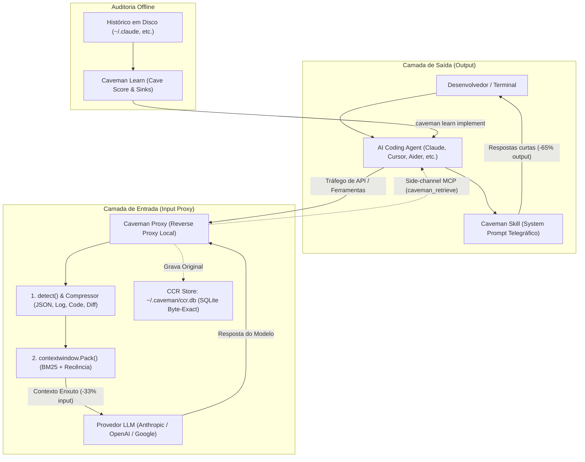

# Caveman — Stack de Otimização e Eficiência de Tokens para Agentes de IA

## 📌 Resumo

O **Caveman** ([JuliusBrussee/caveman](https://github.com/JuliusBrussee/caveman) / [caveman.so](https://caveman.so)), criado por Julius Brussee, é um ecossistema modular de eficiência de contexto (*efficiency operating stack*) projetado para reduzir o consumo de tokens e a latência em mais de 30 agentes de codificação (incluindo Claude Code, Cursor, Cline, Windsurf, Gemini CLI, Aider e Codex).

Originalmente concebido como uma técnica de *prompt engineering* telegráfico (*caveman-speak*), o projeto evoluiu para o **Caveman 2**, uma suíte integrada que combina:
1. **Caveman Skill (Output Compression - MIT):** Comprime as respostas geradas pelo LLM eliminando palavras vazias e cortesias.
2. **Caveman Proxy (Input Compression - BSL 1.1 / MIT CLI):** Reverse proxy local que intercepta e comprime payloads enviados aos provedores (Anthropic, OpenAI, Google) com suporte a recuperação exata (*CCR — Content-Addressed Context Recovery*).
3. **Caveman Learn:** Analisador estático que inspeciona o histórico local do agente no disco, calcula o *Cave Score* e propõe otimizações de contexto.

No [[adocao-de-ferramenta]], o Caveman é classificado como **Otimização Operacional Ad-hoc (P2)**: altamente eficiente para reduzir custos e latência em sessões longas de terminal e loops de automação, mas sem substituir boas práticas estruturais de arquitetura de contexto.

> 💡 **Analogia:** Usar telegrama em vez de carta formal. O endereço de entrega, comandos e dados da transação permanecem 100% literais e exatos (*byte-exact*), mas todos os floreios de abertura, despedida e preenchimento são descartados para economizar por caractere transmitido.

---

## 🧠 1. Arquitetura Técnica dos Módulos

O ecossistema divide-se em duas camadas complementares (Input e Output), orquestradas localmente:



---

### Componentes Principais

#### 1. Caveman Skill (Compressão de Saída — MIT)
* **Princípio Telegráfico:** Força o modelo a responder no estilo conciso (*"why use many token when few do trick"*).
* **Preservação Byte-Exact Rígida:** Blocos de código, comandos bash/powershell, caminhos de arquivo, variáveis e mensagens de erro do compilador permanecem estritamente intactos e literais.
* **Níveis de Compressão:**
  * **`Lite` (~30% redução):** Remove introduções e conclusões óbvias, preservando frases completas.
  * **`Full` (~65% redução - Padrão):** Frases diretas e telegráficas; apenas verbos e substantivos essenciais.
  * **`Ultra` (~75% redução):** Mínimo absoluto de palavras; ideal para loops de scripts e automações em background.
  * **`Wenyan` (~80% redução):** Compressão sintática extrema inspirada em estruturas do chinês clássico.

#### 2. Caveman Proxy & Engine (Compressão de Entrada — BSL 1.1 / MIT CLI)
* **Roteamento Transparente:** Executado via wrapper de terminal (ex: `caveman claude`, `caveman codex`). Intercepta o tráfego HTTP/WebSocket antes de chegar ao provedor, repassando credenciais OAuth Pro/Max intactas.
* **Motor `detect()` e Compressores Especializados:**
  * **`json` (70–90% economia):** Preserva chaves e estruturas; colapsa arrays repetitivos e dados volumosos.
  * **`log` (85–95% economia):** Mantém erros, stack traces e primeiras/últimas linhas; descarta ruído INFO e progresso.
  * **`code` (40–70% economia):** Preserva imports, tipos e assinaturas; elide corpos de funções mantendo sintaxe válida.
  * **`diff` (60–80% economia):** Preserva cabeçalhos de arquivos/hunks e linhas alteradas; enxuga contexto inalterado.
  * **`search-result` (80–95% economia):** Mantém apenas os melhores matches e sinais de diagnóstico.
* **Orquestração de Contexto (`contextwindow.Pack()`):** Aloca os itens comprimidos no orçamento de tokens usando relevância BM25, recência temporal e sinal de erro, preservando a ordem cronológica original.

#### 3. CCR (Content-Addressed Context Recovery)
* **Segurança contra Perda de Informação:** Como a compressão de contexto pode omitir linhas necessárias, o proxy salva os bytes originais em um banco SQLite local (`~/.caveman/ccr.db`).
* **Recuperação Sob Demanda:** O proxy retorna um identificador de recuperação. Se o modelo precisar do payload bruto completo, ele invoca a ferramenta MCP side-channel `caveman_retrieve` sem necessidade de reexecutar as ferramentas de terminal.

#### 4. Caveman Learn (`caveman learn`)
* **Auditoria de Histórico Local:** Analisa logs de sessões passadas no disco (Claude Code, Codex, Gemini CLI, opencode, Aider) sem enviar dados para a nuvem.
* **Relatório Diagnóstico:** Gera o *Cave Score*, ranqueia os principais ralos de tokens (*token sinks*), traça histogramas de profundidade de contexto e simula o impacto financeiro das correções nos últimos 30 dias.
* **Remediação Interativa (`caveman learn implement`):** Abre o agente com as correções sugeridas em formato de diff, aplicando apenas com consentimento do usuário e revertendo alterações que não reduzam o custo por turno.

#### 5. Pixel Mode (Otimização Multimodal)
* Converte logs densos, esquemas JSON gigantes e tabelas em imagens PNG compactas para modelos com capacidades de visão, aproveitando precificações onde tokens de imagem custam menos que tokens textuais equivalentes.

---

## ⚖️ 2. Análise Crítica: Fatos vs. Marketing

### 1. Promessas de Marketing vs. Realidade na Fatura

```
┌─────────────────────────────────────────────────────────────────────────────┐
│                      ESTRUTURA DE CUSTOS DE UMA SESSÃO                      │
├─────────────────────────────────────────────────────────────────────────────┤
│ 1. TOKENS DE ENTRADA (Input) ~80-90% do Custo:                              │
│    • Arquivos lidos e codebase indexing                                     │
│    • Histórico acumulado de turnos anteriores                               │
│    • System prompt & Definições de ferramentas                              │
│    • Saída de ferramentas / Bash                                            │
│    └── [Atuação do Caveman Proxy: -33.2% medidos em benchmark]              │
│                                                                             │
│ 2. TOKENS DE SAÍDA (Output) ~10-20% do Custo:                               │
│    • Prosa explicativa e código gerado pelo modelo                          │
│    └── [Atuação da Caveman Skill: -60% a -65% na prosa de saída]            │
└─────────────────────────────────────────────────────────────────────────────┘
```

* **Impacto da Skill Isolada:** A Caveman Skill economiza 60–65% nos tokens de saída. Como o output representa apenas 10% a 20% do volume total de uma sessão de agente, o impacto financeiro líquido da skill isolada na fatura varia entre **8% e 18%**.
* **Impacto Combinado (Skill + Proxy):** Em benchmarks controlados (*counterfactual benchmark* de 54 execuções no Claude Code), o Caveman Proxy atingiu **33.2% de redução real em input tokens** mantendo 100% de precisão nos testes exatos. A economia líquida total da suíte completa varia entre **25% e 45%** na fatura.

---

### 2. Riscos e Efeitos Colaterais

1. **Perda de Nuance Didática:** O estilo telegráfico elimina explicações pedagógicas. Não deve ser usado quando o objetivo da sessão for aprender uma nova tecnologia ou entender o racional detalhado de uma decisão arquitetural.
2. **Licenciamento Misto (BSL 1.1):** Enquanto a Skill e a CLI são de código aberto sob licença MIT, o runtime do Caveman Engine / Proxy utiliza a licença **BSL 1.1** (Business Source License), que impõe restrições para uso comercial em larga escala / concorrência de serviço.
3. **Ponto Único de Falha Local:** Como o Proxy roda como intermediário HTTP local, falhas no processo ou corrupção no banco CCR SQLite (`~/.caveman/ccr.db`) podem interromper a conectividade do agente com as APIs externas.

---

### 3. Comparativo Estrutural: Caveman vs. RTK vs. Truncamento Nativo

| Critério | [[caveman]] (Skill & Proxy) | [[rtk]] (`rtk-ai/rtk`) | Truncamento Nativo do Agente |
| :--- | :--- | :--- | :--- |
| **Foco Principal** | **Tokens de Saída (Skill)** e **Tráfego HTTP/API (Proxy)** | **Tokens de Entrada CLI** (Saídas Bash / Terminal) | **Proteção de Janela** (Evitar estouro de contexto) |
| **Camada de Execução**| System Prompt + Reverse Proxy HTTP local | Binário CLI em Rust / Hooks de Bash | Engine interna do Agente |
| **Linguagem Base** | TypeScript / Node.js / Go | **Rust puro (binário único, <10ms)**| Go / TypeScript / Rust nativo do agente |
| **Recuperação** | **CCR Store** (`~/.caveman/ccr.db` via tool MCP) | **Tee System** (`~/.local/share/rtk/tee/`) | Nenhuma (dados descartados) |
| **Licença** | **MIT (Skill/CLI) / BSL 1.1 (Proxy Engine)** | **Apache 2.0 (100% Open Source)** | Proprietária / MIT conforme o agente |
| **Sinergia** | **Máxima:** O Caveman enxuga a prosa do LLM e requisições HTTP; o RTK filtra saídas pesadas de testes e linters no terminal. | | |

---

## 🔄 3. Desambiguação Técnica

Não confundir o ecossistema de agentes de IA com outros homônimos:

1. **Caveman2 ([fukamachi/caveman](https://github.com/fukamachi/caveman)):** Framework web MVC consolidado para a linguagem **Common Lisp**, baseado na especificação Clack/Lack e roteamento Ningle. Não tem nenhuma relação com IA ou engenharia de prompts.
2. **Criptomoedas / Memecoins ($CAVEMAN):** Tokens especulativos não relacionados presentes em redes como Solana e Base.

---

## 🛠️ 4. Guia Rápido de Instalação e Uso

### 1. Instalação da Caveman Skill (Apenas Saída Telegráfica — MIT)

```bash
# Via Skills CLI (compatível com 30+ agentes)
npx skills add JuliusBrussee/caveman

# Claude Code (via plugin marketplace)
claude plugin marketplace add JuliusBrussee/caveman && claude plugin install caveman@caveman

# Gemini CLI
gemini extensions install https://github.com/JuliusBrussee/caveman
```

### 2. Instalação do Caveman Proxy & Engine (Entrada + Saída — BSL/MIT)

```bash
# Instalação global do CLI
npm install -g @caveman-ai/cli && caveman setup --install

# Executar agentes envelopados pelo proxy local
caveman claude        # Claude Code com CCR e compressão de input
caveman codex         # OpenAI Codex CLI
caveman gemini        # Gemini CLI
```

### 3. Diagnóstico e Otimização de Histórico

```bash
# Analisar histórico local e calcular Cave Score
caveman learn

# Aplicar plano de melhorias no agente de forma interativa via diffs
caveman learn implement
```

---

## 🎯 5. Veredito de Adoção

```
                       PORTÃO DE ADOÇÃO: CAVEMAN
                                   │
     ┌─────────────────────────────┴─────────────────────────────┐
     ▼                                                           ▼
[ QUANDO USAR ]                                         [ QUANDO NÃO USAR ]
 • Sessões longas de refatoração e terminal              • Pareamento exploratório e aprendizado
 • Loops autônomos de CI / background tasks              • Revisão de arquitetura e decisões de negócio
 • Modelos com custo elevado por token de saída          • Ambientes com restrição estrita a licenças BSL
 • Auditoria de consumo via 'caveman learn'              • Instalação cega de skills sem curadoria
```

### Quando USAR
* **Sessões Longas de Refatoração e Codificação:** Onde o desenvolvedor só precisa do código alterado e do status das tarefas, sem necessidade de introduções explicativas.
* **Automações em Background e Pipelines de CI:** Onde nenhuma pessoa está lendo as mensagens intermediárias do agente.
* **Modelos com Alto Custo de Saída:** Maximiza a taxa de transferência (*tokens/sec*) e reduz a latência de geração do modelo.

### Quando NÃO USAR
* **Pareamento Didático / Onboarding:** Quando o objetivo é aprender o funcionamento de um novo framework ou entender conceitos teóricos.
* **Discussões Arquiteturais Complexas e ADRs:** Onde justificativas técnicas detalhadas, trade-offs e nuances de segurança são cruciais (ver [[adocao-de-ferramenta]]).
* **Restrições Corporativas contra BSL 1.1:** Caso a política interna da empresa proíba o uso de componentes com licença Business Source License (nesse cenário, adotar apenas a *Skill MIT* ou utilizar o [[rtk]]).

---

## 🔗 Ver também

* [[adocao-de-ferramenta]] — portão de adoção e critérios de avaliação de ferramentas.
* [[rtk]] — proxy CLI de alta performance em Rust para filtragem de saídas de terminal.
* [[ponytail]] — engenharia minimalista e prevenção de over-engineering para agentes.
* [[find-skills]] — riscos de inchaço de contexto e governança de skills em agentes.
* [[agent-browser]] — automação e navegação web otimizada para agentes.
* [[prompt-engineering]] — fundamentos de clareza, delimitadores e formatação de saídas em LLMs.
* [[global-rules]] — regras de comportamento e concisão padrão para agentes no vault.

---

## 📚 Fontes

* [Repositório JuliusBrussee/caveman](https://github.com/JuliusBrussee/caveman) — Código-fonte oficial, documentação e releases.
* [Portal Oficial Caveman](https://caveman.so) — Plataforma e recursos do ecossistema.
* [Benchmark Caveman Wrap (GitHub)](https://github.com/JuliusBrussee/caveman/blob/main/docs/WRAP-BENCHMARK.md) — Metodologia e resultados do benchmark com Claude Code.
* [Repositório fukamachi/caveman (Caveman2)](https://github.com/fukamachi/caveman) — Framework web MVC para Common Lisp (desambiguação).
