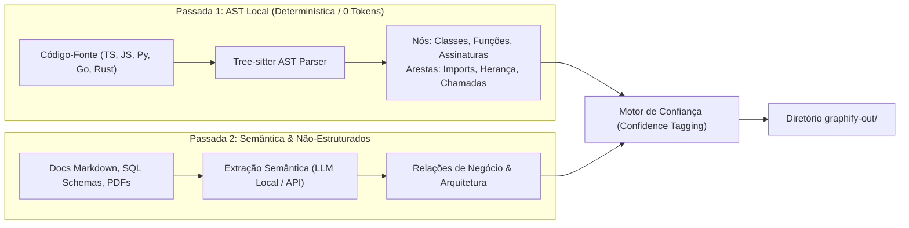

# Graphify — Grafos de Conhecimento Estrutural e Navegação de Codebase para Agentes de IA

## 📌 Resumo

O **Graphify** ([Graphify-Labs/graphify](https://github.com/Graphify-Labs/graphify)) é uma ferramenta open-source de engenharia de contexto projetada para transformar bases de código completas, esquemas de banco de dados e documentações em um **Grafo de Conhecimento Estrutural e Navegável (*Codebase Knowledge Graph*)** voltado para agentes de codificação (como Claude Code, Cursor, Codex, Gemini CLI, Cline e Windsurf).

Seu objetivo é resolver o problema do **"Grep Cego"** e a leitura sequencial de arquivos (*flat-file context*), permitindo que agentes de IA compreendam a topologia arquitetural, grafos de chamada (*call graphs*) e dependências cruzadas entre múltiplos módulos sem estourar a janela de contexto.

```
┌─────────────────────────────────────────────────────────────────────────────┐
│                       AVISO CRÍTICO DE INSTALAÇÃO (PYPI)                    │
├─────────────────────────────────────────────────────────────────────────────┤
│ • Pacote Oficial no PyPI:  graphifyy  (com DOIS 'y's)                       │
│ • Repositório GitHub:       Graphify-Labs/graphify                          │
│ • Comando CLI no terminal:  graphify  (com UM 'y')                          │
│ • ⚠️ CUIDADO: O pacote 'graphify' (com um y) no PyPI é um projeto não       │
│   relacionado e não possui qualquer ligação com este ecossistema de IA.     │
└─────────────────────────────────────────────────────────────────────────────┘
```

No [[adocao-de-ferramenta]], o Graphify é classificado como **Indexação Estrutural de Codebase / Adoção com Gatilho (P2)**: altamente recomendável para repositórios médios a grandes (>30k linhas de código) ou onboarding em bases legadas, mas desnecessário para protótipos de arquivo único.

> 💡 **Analogia:** O grep comum é como procurar uma rua folheando um livro de endereços linha por linha. O Graphify é o mapa topológico do GPS: mostra como os bairros e avenidas se conectam antes de você entrar em qualquer rua específica.

---

## 🧠 1. O Problema Fundamental: "Flat-File Context" vs. Grafos de Código

Quando um agente de IA tradicional atua sobre um repositório, ele normalmente depende de:
1. **Busca Textual (Grep / Glob / Ripgrep):** Encontra strings literais, mas não entende quem instancia quem, quais métodos herdam de uma classe base ou qual rota da API atinge qual tabela do banco.
2. **RAG Vetorial Ingênuo (Embeddings):** Mede proximidade semântica de texto. Falha em código porque um trecho de autenticação pode ser semanticamente distante de uma rota de faturamento, embora estejam conectados diretamente no fluxo de execução.
3. **Bundlers de Contexto Plano (Repomix / Dumps):** Despejam arquivos inteiros no prompt. Isso consome centenas de milhares de tokens, degrada a atenção do modelo (*lost in the middle*) e eleva o custo por requisição.

O Graphify resolve isso criando uma camada intermediária determinística: constrói um grafo relacional explícito onde nós são entidades de código (funções, classes, rotas, tabelas) e arestas são relações de execução (`CALLS`, `IMPORTS`, `IMPLEMENTS`, `WRITES_TO`).

```mermaid
flowchart TD
    subgraph "Abordagem Tradicional (Linear / RAG)"
        User1["Prompt do Usuário"] --> Grep["Grep / Busca Vetorial"]
        Grep -->|"Lê dezenas de arquivos inteiros"| LLM1["LLM Window (Inchaço de Tokens)"]
        LLM1 -->|"Alucinação de fluxo"| Fail["Perde dependências distantes"]
    end

    subgraph "Abordagem Graphify (Topológica)"
        User2["Prompt do Usuário"] --> GraphQuery["Consulta ao Grafo (graph.json)"]
        GraphQuery -->|"Travessia em K-Hops (Nós exatos)"| GraphData["Apenas entidades e contratos relevantes"]
        GraphData -->|"Contexto Cirúrgico"| LLM2["LLM Window (-80% tokens)"]
        LLM2 -->|"Certeza topológica"| Success["Execução Precisa"]
    end
```



---

## ⚙️ 2. Arquitetura Técnica & Pipeline em Duas Passadas

O Graphify combina análise estática puramente determinística (sem custo de tokens) com uma camada semântica opcional para documentações:



### 1. Passada 1: Parsing AST com Tree-sitter (100% Local e Privado)
- Utiliza **Tree-sitter** para extrair a Árvore de Sintaxe Abstrata (AST) de forma nativa e determinística.
- Não envia código para APIs externas.
- Extrai:
  - Assinaturas de métodos e funções (parâmetros, tipos de retorno).
  - Relações de herança, interfaces e tipagens.
  - Grafo de chamadas de primeiro nível e importações entre arquivos.

### 2. Passada 2: Enriquecimento Semântico (Arquivos Não-Código)
- Analisa documentações (`README.md`, notas arquiteturais, diagramas, esquemas DDL de bancos de dados).
- Conecta termos conceituais de negócio aos símbolos concretos do código.

### 3. Sistema de Marcação por Níveis de Confiança (*Confidence Tagging*)
Para evitar alucinações e permitir que o agente saiba o quão confiável é cada caminho no grafo, toda aresta recebe uma classificação estrita:

| Nível | Score | Origem | Significado para o Agente |
| :--- | :---: | :--- | :--- |
| **`EXTRACTED`** | **`1.0`** | AST Tree-sitter estático | Relação explícita no código (ex: `import`, chamada direta). Certeza absoluta. |
| **`INFERRED`** | **`0.7 – 0.9`** | Inferência de tipos / semântica de docs | Deduzido por convenções de nomenclatura ou documentação associada. |
| **`AMBIGUOUS`** | **`< 0.7`** | Despacho dinâmico / reflection | Chamadas polimórficas, `getattr()` em Python ou imports dinâmicos em JS. Requer verificação ativa. |

---

## 📦 3. Artefatos Gerados (`graphify-out/`)

Ao executar o comando `/graphify` ou `graphify run` na raiz do repositório, o motor gera três artefatos no diretório local `graphify-out/`:

```text
meu-projeto/
├── graphify-out/
│   ├── graph.json         # O grafo completo estruturado para consumo de LLMs
│   ├── graph.html         # Visualização visual interativa para o desenvolvedor
│   └── GRAPH_REPORT.md    # Resumo arquitetural executivo em Markdown
```

1. **`graph.json` (Machine-Readable):** Contém a lista de nós, atributos, assinaturas de métodos e arestas indexadas por ID. Usado pelo agente para análise de impacto e cálculo de raio de alcance (*blast radius*).
2. **`graph.html` (Interactive Browser Canvas):** Interface standalone em HTML/JS para inspeção visual de clusters, dependências circulares e acoplamento.
3. **`GRAPH_REPORT.md` (Resumo Arquitetural):** Síntese em Markdown com conceitos centrais, nós de alta conectividade e conexões inesperadas.

---

## ⚖️ 4. Matriz Comparativa: Graphify vs. Outras Abordagens

```
┌─────────────────┬──────────────────────┬──────────────────────┬──────────────────────┬──────────────────────┐
│ Critério        │ Graphify (graphifyy) │ [[graphiti]] (Zep)   │ RAG Vetorial Padrão  │ [[rtk]] / [[caveman]]│
├─────────────────┼──────────────────────┼──────────────────────┼──────────────────────┼──────────────────────┤
│ **Domínio de    │ **Estrutura de       │ **Memória de Usuário │ Trechos de texto     │ **Tráfego de CLI /   │
│ Aplicação**     │ Codebase e Código**  │ e Fatos de Negócio** │ genéricos            │ Saída de Terminal**  │
├─────────────────┼──────────────────────┼──────────────────────┼──────────────────────┼──────────────────────┤
│ **Mecanismo     │ **AST Tree-sitter    │ Extração LLM de      │ Embeddings densos    │ Heurísticas Rust /   │
│ Central**       │ + Grafo Topológico** │ tripletos relacionais│ (Similaridade Cosseno│ Prompts telegráficos │
├─────────────────┼──────────────────────┼──────────────────────┼──────────────────────┼──────────────────────┤
│ **Consciência   │ Estática do código   │ **Nativa Bi-temporal │ Nula                 │ Nula                 │
│ Temporal**      │ (Snapshot do repo)   │ (invalidação `valid`)│                      │                      │
├─────────────────┼──────────────────────┼──────────────────────┼──────────────────────┼──────────────────────┤
│ **Infraestrutura│ **Zero infra**       │ Banco Neo4j /        │ Vector DB (Chroma,   │ **Zero infra**       │
│ Exigida**       │ (arquivos locais)    │ FalkorDB dedicado    │ pgvector, Qdrant)    │ (binários locais)    │
├─────────────────┼──────────────────────┼──────────────────────┼──────────────────────┼──────────────────────┤
│ **Custo de      │ **Zero tokens**      │ Alto (inferência de  │ Baixo (modelo de     │ Zero tokens          │
│ Indexação**     │ para código (AST)    │ LLM por episódio)    │ embeddings)          │                      │
└─────────────────┴──────────────────────┴──────────────────────┴──────────────────────┴──────────────────────┘
```

---

## 🎯 5. Avaliação no Portão de Adoção (`adocao-de-ferramenta`)

### Quando USAR
- **Monorepos e Codebases Médios a Grandes (>30k LOC):** Onde o agente costuma se perder entre múltiplos módulos e serviços.
- **Onboarding Rápido em Projetos Legados:** Para entender o fluxo de dados e dependências antes de alterar código.
- **Análise de Raio de Impacto (*Blast Radius Analysis*):** Identificar todas as funções e rotas afetadas antes de refatorar uma assinatura central.

### Quando NÃO USAR
- **Scripts Simples e Projetos de Arquivo Único:** Onde a leitura direta do arquivo é mais rápida e consome menos overhead.
- **Linguagens com Metaprogramação Extrema e Sem Tipagem:** Projetos onde 100% dos imports ou chamadas são dinâmicos via strings em tempo de execução.
- **Bases de Conhecimento Puramente Textuais:** Documentações e manuais estáticos (onde RAG vetorial ou BM25 resolve com menor complexidade).

---

## 🛠️ 6. Guia Rápido de Instalação e Uso

### 1. Instalação do Pacote CLI

```bash
# Via uv (Recomendado)
uv tool install graphifyy

# Ou via pipx
pipx install graphifyy
```

### 2. Registro no Agente de IA

```bash
# Registra o comando /graphify no Claude Code, Cursor, etc.
graphify install
```

### 3. Execução no Projeto

```bash
# Gera os artefatos em graphify-out/
graphify run

# Ou interativamente dentro da sessão do agente:
/graphify
```

---

## 🔗 Ver também

- [[graphiti]] — grafos de conhecimento temporais e memória dinâmica (desambiguação).
- [[rtk]] — proxy CLI em Rust para filtragem de saídas de terminal.
- [[caveman]] — stack de eficiência de tokens e saída telegráfica.
- [[ponytail]] — engenharia minimalista e prevenção de over-engineering em código.
- [[clean-code]] — padrão de escrita, refatoração e legibilidade de código.
- [[adocao-de-ferramenta]] — portão de adoção técnica e critérios de estágio.
