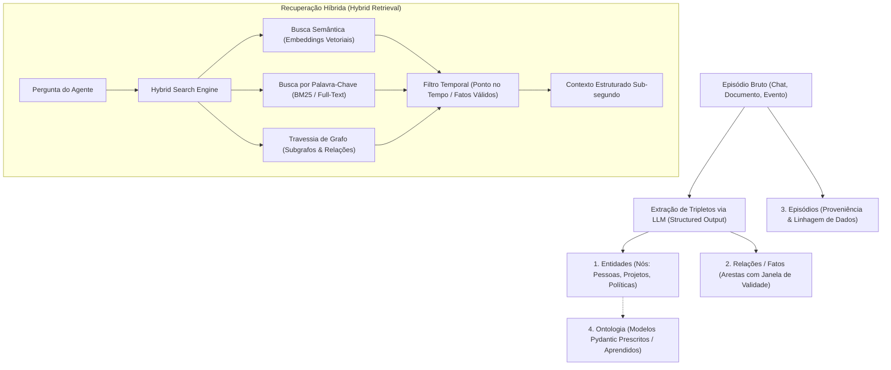

# Graphiti — Grafos de Conhecimento Temporal e Memória Dinâmica para Agentes de IA

## 📌 Resumo

O **Graphiti** ([getzep/graphiti](https://github.com/getzep/graphiti) / [getzep.com](https://www.getzep.com)), criado pela **Zep**, é um framework open-source em Python (licença **Apache 2.0**) projetado para construir e consultar **Grafos de Conhecimento Temporais (*Temporal Knowledge Graphs / Context Graphs*)** voltados para agentes de IA e aplicações RAG dinâmicas.

Diferente de sistemas RAG vetoriais estáticos (que apenas quebram textos em *chunks* e calculam embeddings), o Graphiti resolve o problema clássico de **contradições temporais** e **fatos mutáveis no tempo** (exemplo: *"O cliente usava o plano Basic em 2024, mas migrou para o Enterprise em 2026"*). Em vez de deletar ou sobrescrever informações, ele estabelece **janelas de validade temporal bi-temporal**, rastreando o que é verdade no momento presente e o que era verdade no passado com proveniência total (*lineage*) até os episódios originais.

No [[adocao-de-ferramenta]], o Graphiti é classificado como **Infraestrutura de Memória e RAG Avançado (P2 com Gatilho)**: indispensável para agentes de longo prazo com histórico dinâmico de usuários ou entidades corporativas, mas desnecessário para tarefas pontuais de codificação ou bases de conhecimento imutáveis.

> 💡 **Analogia:** Um banco de dados vetorial ingênuo é como uma pilha de fotos desordenadas: se você buscar "onde o usuário mora", ele encontrará fotos dele em São Paulo e em Curitiba com alta similaridade e ficará confuso. O Graphiti é uma linha do tempo jurídica estruturada: sabe exatamente quando o usuário se mudou, invalida o endereço antigo para respostas atuais, mas mantém o registro histórico intacto.

---

## 🧠 1. Arquitetura Técnica & Modelo de Context Graph

O Graphiti estrutura os dados como um **Grafo de Contexto (*Context Graph*)** dinâmico composto por quatro primitivas fundamentais:



### Os 4 Componentes do Grafo de Contexto

| Componente | O que armazena | Mecânica Interna |
| :--- | :--- | :--- |
| **Entities (Nós)** | Pessoas, produtos, políticas, empresas, conceitos. | Possui resumos que evoluem dinamicamente conforme novos fatos são ingeridos. |
| **Facts / Relationships (Arestas)** | Tripletos relacionais: `(Entidade A) ──[Relação]──> (Entidade B)`. | Contém **janela de validade temporal** (`valid_at`, `invalid_at`). Fatos obsoletos são invalidados, nunca apagados. |
| **Episodes (Proveniência)** | Stream de dados brutos ingeridos (mensagens de chat, logs, PDFs). | Todo nó e aresta aponta para o ID do episódio gerador, permitindo rastreabilidade jurídica e de depuração. |
| **Ontology (Custom Types)** | Tipos de entidades e arestas. | Suporta **Ontologia Prescrita** (schemas estritos via Pydantic) ou **Ontologia Aprendida** (descoberta autônoma). |

---

## 🧠 2. Mecânica de Recuperação Híbrida & Invalidação

### 1. Invalidação Temporal vs. Exclusão Destrutiva
Quando uma nova informação contradiz um fato anterior (ex: "Empresa X cancelou o contrato Y"):
1. O Graphiti identifica a contradição usando extração estruturada do LLM.
2. O fato anterior tem seu campo `invalid_at` preenchido com o timestamp do novo episódio.
3. O novo fato é inserido com o timestamp `valid_at` atual.
4. Consultas sobre o "estado atual" filtram automaticamente fatos onde `invalid_at IS NULL`, enquanto consultas históricas (*"Qual era o plano do cliente em janeiro de 2025?"*) recuperam com exatidão o estado da época.

### 2. Recuperação Híbrida Tripla (*Hybrid Retrieval*)
Para responder com latência sub-segundo sem depender de sumarizações custosas de LLM a cada busca, o Graphiti combina três motores:
* **Vetorial (Dense Retrieval):** Encontra nós e arestas semanticamente próximos ao prompt.
* **Lexical (BM25 / Full-text):** Garante precisão em termos exatos, IDs, nomes próprios e códigos de produto.
* **Graph Traversal (K-Hop Neighborhood):** Navega pelas arestas vizinhas para recuperar dependências indiretas que a busca vetorial isolada perderia.

### 3. Backends de Armazenamento Suportados
* **Neo4j** (>= 5.26) — Padrão de mercado para grafos corporativos.
* **FalkorDB** (>= 1.1.2) — Motor de grafos em memória de baixíssima latência construído sobre Redis.
* **Amazon Neptune + OpenSearch Serverless** — Stack gerenciada na AWS para alta escala.

---

## ⚖️ 3. Análise Crítica: Fatos vs. Marketing

### 1. Graphiti vs. GraphRAG da Microsoft vs. RAG Vetorial Tradicional

```
┌─────────────────┬──────────────────────┬──────────────────────┬──────────────────────┐
│ Critério        │ Graphiti (Zep)       │ GraphRAG (Microsoft) │ RAG Vetorial Padrão  │
│                 │                      │                      │ (Chroma, pgvector)   │
├─────────────────┼──────────────────────┼──────────────────────┼──────────────────────┤
│ **Foco Principal│ **Grafos Temporais e │ Sumarização estática │ Similaridade de      │
│                 │ Memória de Agentes** │ de documentos em lote│ trechos de texto     │
├─────────────────┼──────────────────────┼──────────────────────┼──────────────────────┤
│ **Atualização   │ **Incremental em     │ Lote (Batch offline) │ Inserção direta de   │
│ de Dados**      │ tempo real**         │ com recomputação cara│ novos embeddings     │
├─────────────────┼──────────────────────┼──────────────────────┼──────────────────────┤
│ **Consciência   │ **Nativa bi-temporal │ Básica (metadados de │ Nula (mistura fatos  │
│ Temporal**      │ com invalidação**    │ data no chunk)       │ novos e antigos)     │
├─────────────────┼──────────────────────┼──────────────────────┼──────────────────────┤
│ **Latência de   │ **Sub-segundo**      │ Lenta (10s a 40s     │ Rápida (10ms a 50ms) │
│ Consulta**      │ (Busca híbrida)      │ devido a resumos LLM)│                      │
├─────────────────┼──────────────────────┼──────────────────────┼──────────────────────┤
│ **Custo de      │ Médio (requer LLM    │ Altíssimo (gera mi-  │ Baixo (apenas modelo │
│ Ingestão**      │ estruturado por msg) │ lhares de resumos)   │ de embeddings)       │
└─────────────────┴──────────────────────┴──────────────────────┴──────────────────────┘
```

---

### 2. Riscos e Trade-offs Operacionais

1. **Complexidade de Infraestrutura:** Diferente de soluções de contexto puramente locais em arquivos (como [[caveman]] ou [[rtk]]), o Graphiti exige a operação de um banco de grafos dedicado (Neo4j ou FalkorDB) e gerência de conexões.
2. **Dependência de *Structured Output* nos LLMs:** A extração confiável de entidades e relações depende de modelos com suporte nativo a JSON Schema estrito (OpenAI, Anthropic, Gemini). Modelos pequenos ou locais sem fine-tuning para *structured output* podem falhar na geração da ontologia.
3. **Custo de LLM na Ingestão:** Cada episódio ingerido consome tokens de LLM para extrair entidades, relações e verificar invalidações temporais.

---

## 🔄 4. Desambiguação Técnica

Não confundir o **Graphiti** com projetos homônimos:

1. **Graphiti ([getzep/graphiti](https://github.com/getzep/graphiti)):** Framework de *Temporal Knowledge Graphs* e memória para agentes de IA (tema desta nota).
2. **Graphify / Graphifyy ([[graphify]]):** Utilitários e scripts focados em converter estruturas de código-fonte (AST via Tree-sitter) em grafos de dependência para agentes de programação.
3. **Graphity (Python GraphQL):** Biblioteca histórica para construção de APIs GraphQL em Python.
4. **Zep Platform:** O produto SaaS comercial da Zep, que oferece uma engine proprietária de contexto em nuvem baseada no Graphiti.

---

## 🛠️ 5. Guia Rápido de Instalação e Uso

### 1. Instalação do Pacote Python

```bash
pip install graphiti-core
```

### 2. Exemplo Básico de Ingestão e Consulta com Invalidação Temporal

```python
import asyncio
from datetime import datetime, timezone
from graphiti_core import Graphiti
from graphiti_core.nodes import EpisodeType

async def main():
    # Inicializa cliente apontando para o Neo4j local
    graphiti = Graphiti(
        "bolt://localhost:7687",
        auth=("neo4j", "password")
    )
    
    # Ingestão de episódio 1 (Fato inicial em 2024)
    await graphiti.add_episode(
        name="onboarding_2024",
        episode_body="Carlos Silva é desenvolvedor pleno na empresa Acme e mora em São Paulo.",
        source=EpisodeType.message,
        source_description="Mensagem de chat de onboarding",
        reference_time=datetime(2024, 1, 15, tzinfo=timezone.utc)
    )
    
    # Ingestão de episódio 2 (Fato que invalida o anterior em 2026)
    await graphiti.add_episode(
        name="update_2026",
        episode_body="Carlos Silva foi promovido a Tech Lead e mudou-se para Curitiba.",
        source=EpisodeType.message,
        source_description="Atualização de perfil no Slack",
        reference_time=datetime(2026, 3, 1, tzinfo=timezone.utc)
    )
    
    # Busca híbrida no estado atual (retorna Curitiba e Tech Lead)
    resultados = await graphiti.search("Onde Carlos Silva mora e qual seu cargo atual?")
    for r in resultados:
        print(f"[{r.fact_type}] {r.fact_text}")

asyncio.run(main())
```

### 3. Integração via MCP (Model Context Protocol)
O Graphiti disponibiliza um servidor MCP oficial, permitindo que ferramentas como Claude Desktop, Cursor e agentes locais acessem a memória temporal via chamadas de ferramentas (*tool use*).

---

## 🎯 6. Veredito de Adoção

```
                       PORTÃO DE ADOÇÃO: GRAPHITI
                                   │
     ┌─────────────────────────────┴─────────────────────────────┐
     ▼                                                           ▼
[ QUANDO USAR ]                                         [ QUANDO NÃO USAR ]
 • Agentes com memória de longo prazo de usuários        • RAG estático sobre manuais e PDFs imutáveis
 • CRMs, ERPs e copilotos com dados que mudam no tempo   • Agentes pontuais de terminal CLI (usar SQLite)
 • Casos onde contradições temporais são críticas        • Projetos que não possuem infraestrutura de banco
 • Auditoria rigorosa de proveniência de dados           • Aplicações onde busca vetorial simples basta
```

### Quando USAR
* **Assistentes Pessoais e Agentes Corporativos de Longo Prazo:** Onde o agente precisa lembrar preferências, histórico de decisões e regras de negócio de clientes que evoluem com o passar dos meses.
* **Sistemas de Atendimento e Suporte Inteligente:** Evita respostas desatualizadas ao lidar com políticas de reembolso ou planos de assinatura que sofreram alterações.
* **Aplicações que Exigem Rastreabilidade (*Provenance*):** Casos onde cada resposta do LLM precisa citar a mensagem ou documento exato que originou a conclusão.

### Quando NÃO USAR
* **Bases de Conhecimento Estáticas:** Documentações técnicas fixas, normas ABNT ou manuais de equipamentos (onde RAG vetorial padrão ou BM25 simples resolve com muito menos complexidade).
* **Otimização de Contexto em Sessões de Terminal:** Para economia de tokens em desenvolvimento e CLI, adote a Tríade de Eficiência ([[rtk]], [[caveman]], [[ponytail]]).
* **Projetos em Fase Inicial (Estágio 1):** Adotar Neo4j e Graphiti antes de validar o caso de uso introduz overengineering de infraestrutura (ver [[adocao-de-ferramenta]]).

---

## 🔗 Ver também

* [[adocao-de-ferramenta]] — portão de adoção e critérios de estágio de infraestrutura.
* [[banco-de-dados-vetorial]] — quando o banco vetorial tradicional resolve e quando se torna gargalo.
* [[caveman]] — stack de eficiência de tokens e persistência leve em SQLite.
* [[rtk]] — proxy CLI para compressão de saída de terminal.
* [[ponytail]] — engenharia minimalista e prevenção de over-engineering em agentes.
* [[prompt-engineering]] — fundamentos de delimitação e extração estruturada de dados.

---

## 📚 Fontes

* [Repositório getzep/graphiti](https://github.com/getzep/graphiti) — Código-fonte oficial, exemplos e documentação.
* [Portal Oficial Zep](https://www.getzep.com) — Plataforma e Context Graph Engine.
* [Artigo Científico arXiv:2501.13956](https://arxiv.org/abs/2501.13956) — *Zep: A Temporal Knowledge Graph Architecture*.
* [Documentação do MCP Server do Graphiti](https://github.com/getzep/graphiti/tree/main/mcp_server) — Servidor Model Context Protocol para agentes.
