# Ponytail — Engenharia Minimalista e Prevenção de Over-engineering para Agentes de IA

## 📌 Resumo

O **Ponytail** ([DietrichGebert/ponytail](https://github.com/DietrichGebert/ponytail) / [ponytail.dev](https://ponytail.dev)), criado por Dietrich Gebert, é um framework comportamental e skill para agentes de codificação (como Claude Code, Codex, Cursor, Cline, Windsurf e Copilot).

Seu propósito é combater o vício de **over-engineering** comum em LLMs — que frequentemente instalam pacotes NPM/pip desnecessários, criam componentes wrappers gigantescos e introduzem camadas de abstração prematuras para tarefas triviais. O Ponytail modela o arquétipo do *"Lazy Senior Developer"* (o desenvolvedor veterano que prefere uma solução nativa de uma linha a 50 linhas de código customizado).

No [[adocao-de-ferramenta]], o Ponytail é classificado como **Adoção Estratégica de Prompt/Persona (P1)**: custo zero de infraestrutura, reduz drasticamente a dívida técnica gerada por IAs e mantém conformidade total com segurança e acessibilidade.

> 💡 **Analogia:** Pedir um seletor de data ao agente comum resulta na instalação do `flatpickr`, criação de um wrapper React de 300 linhas, folha de estilos e discussão sobre fusos horários. Com o Ponytail, o agente simplesmente emite `<input type="date">`.

---

## 🧠 1. A Escada de Decisão de 7 Degraus (*The Decision Ladder*)

Antes de emitir qualquer bloco de código, o agente é instruído a subir obrigatoriamente a escada de decisão, parando no **primeiro degrau que resolver o problema**:

```mermaid
flowchart TD
    Task["Requisito / Solicitação de Código"] --> Rung1{"1. Precisa existir?"}
    Rung1 --"Não (YAGNI)"--> Skip["Não escreve nada / Remove código desnecessário"]
    Rung1 --"Sim"--> Rung2{"2. Já existe no codebase?"}
    Rung2 --"Sim"--> Reuse["Reutiliza função / helper existente"]
    Rung2 --"Não"--> Rung3{"3. A Standard Library resolve?"}
    Rung3 --"Sim"--> Stdlib["Usa built-ins da linguagem (ex: fetch, path, itertools)"]
    Rung3 --"Não"--> Rung4{"4. Existe API / Recurso Nativo da Plataforma?"}
    Rung4 --"Sim"--> Native["Usa HTML5/CSS/DOM nativo (ex: <dialog>, <input type=date>)"]
    Rung4 --"Não"--> Rung5{"5. Dependência já instalada resolve?"}
    Rung5 --"Sim"--> ExtDep["Usa biblioteca já presente no package.json / pyproject.toml"]
    Rung5 --"Não"--> Rung6{"6. Dá pra resolver em 1 linha?"}
    Rung6 --"Sim"--> OneLine["Implementa solução concisa e elegante de linha única"]
    Rung6 --"Não"--> Rung7["7. Escreve o código mínimo necessário"]
```



---

## 🧠 2. Princípios Operacionais Fundamentais

### 1. "Preguiçoso na Solução, Diligente na Leitura"
O modelo não deve ser preguiçoso na etapa de análise: ele lê profundamente a base de código, rastreia os fluxos reais de dados e compreende o contexto antes de escolher o degrau mais simples.

### 2. "Preguiçoso, mas Nunca Negligente" (*Lazy, Not Negligent*)
A busca por concisão não pode sacrificar a robustez:
* **Fronteiras de Confiança & Validação:** Sanitização de inputs e validações de borda permanecem obrigatórias.
* **Prevenção de Perda de Dados:** Operações destrutivas exigem tratamento defensivo.
* **Segurança e Acessibilidade (a11y):** Labels, papéis ARIA e conformidade WCAG nunca são cortados para economizar linhas.

---

## ⚖️ 3. Análise Crítica e Métricas de Benchmark

### 1. Benchmark em Repositório Real (FastAPI + React)

Diferente de benchmarks sintéticos (*single-shot*), o Ponytail foi auditado em sessões completas do Claude Code atuando sobre o repositório oficial [tiangolo/full-stack-fastapi-template](https://github.com/fastapi/full-stack-fastapi-template) (12 tarefas de features reais, modelo Haiku 4.5, n=4):

| Métrica Avaliada | Ponytail vs. Baseline (Sem Skill) | Prompt Ingênuo ("Write one-liners") |
| :--- | :--- | :--- |
| **Linhas de Código (LOC)** | **-54%** (até -94% em armadilhas de UI) | -33% |
| **Tokens Consumidos** | **-22%** | -14% |
| **Custo Financeiro da Sessão** | **-20%** | -21% |
| **Tempo de Execução** | **-27%** | -30% |
| **Preservação de Segurança (Safety)**| **100%** (todos os guards mantidos) | **95%** (perda de verificações defensivas) |

> [!NOTE]
> O maior ganho ocorre em tarefas onde LLMs costumam criar armadilhas de over-building (ex: color picker, date picker, modais, parsers JSON manuais). Em tarefas de algoritmos já mínimos, o impacto em LOC aproxima-se de zero.

---

## 🧩 4. A Tríade de Eficiência para Agentes de IA

No ecossistema moderno de desenvolvimento com agentes, as três principais ferramentas de otimização atuam em camadas distintas e complementares:

```
┌─────────────────────────────────────────────────────────────────────────────┐
│                    A TRÍADE DE EFICIÊNCIA DE CONTEXTO                       │
├─────────────────┬──────────────────────┬────────────────────────────────────┤
│ Ferramenta      │ Camada de Atuação    │ Mecanismo Principal                │
├─────────────────┼──────────────────────┼────────────────────────────────────┤
│ **[[rtk]]**     │ **Input de Terminal**│ Proxy Rust que filtra saídas rui-  │
│                 │ (CLI / Bash)         │ dosas de testes, linters e git     │
├─────────────────┼──────────────────────┼────────────────────────────────────┤
│ **[[caveman]]** │ **Output de Diálogo**│ Prompt telegráfico e proxy HTTP    │
│                 │ (Prosa do LLM)       │ eliminando polidez e cortesias     │
├─────────────────┼──────────────────────┼────────────────────────────────────┤
│ **[[ponytail]]**│ **Código e Design**  │ Escada de 7 degraus prevenindo     │
│                 │ (Engenharia de SW)   │ dependências e over-engineering    │
└─────────────────┴──────────────────────┴────────────────────────────────────┘
```

---

## 🛠️ 5. Instalação e Ativação

### Claude Code
```bash
/plugin marketplace add DietrichGebert/ponytail
/plugin install ponytail@ponytail
```

### OpenAI Codex CLI
```bash
codex plugin marketplace add DietrichGebert/ponytail
codex plugin add ponytail@ponytail
```

### GitHub Copilot CLI
```bash
copilot plugin marketplace add DietrichGebert/ponytail
copilot plugin install ponytail@ponytail
```

### Cursor / Windsurf / Cline (Via Regras ou Skills)
Pode ser injetado diretamente nas regras de workspace (`.cursorrules`, `.windsurfrules` ou skill do Cline):
```markdown
# Ponytail Decision Ladder:
Before writing code, stop at the first rung that solves the issue:
1. Does it need to exist? (YAGNI) -> Skip.
2. Already in codebase? -> Reuse.
3. Stdlib does it? -> Use built-in.
4. Native platform feature? (HTML5/CSS/DOM) -> Use native.
5. Installed dependency? -> Use existing.
6. Can it be one line? -> One line.
7. Only then: write the minimum robust code. Never sacrifice security or accessibility.
```

---

## 🎯 6. Veredito de Adoção

### Quando USAR
* **Desenvolvimento Frontend e Web Moderno:** Onde IAs costumam instalar pacotes externos para recursos já nativos dos navegadores.
* **Projetos com Foco em Manutenibilidade e Clean Code:** Evita o acúmulo de bibliotecas não mantidas no `package.json` ou `pyproject.toml`.
* **Sessões Autônomas de Código:** Mantém os diffs pequenos, fáceis de revisar em PRs e rápidos de compilar.

### Quando NÃO USAR
* **Exploração Arquitetural para Sistemas Distribuídos Complexos:** Onde abstrações corporativas, padrões de mensageria e contratos formais múltiplos são requisitos intencionais do design.
* **Projetos com Design System Estrito Pré-existente:** Quando um componente visual proprietário complexo já é a diretriz mandatória da empresa (embora o degrau 2 cubra isso via reuso).

---

## 🔗 Ver também

* [[adocao-de-ferramenta]] — portão de adoção e critérios de avaliação de ferramentas.
* [[rtk]] — proxy CLI em Rust para compressão de saída de terminal.
* [[caveman]] — stack de compressão de contexto e saída telegráfica.
* [[prompt-engineering]] — fundamentos de clareza e controle de contexto.
* [[global-rules]] — regras de comportamento e concisão para agentes no vault.

---

## 📚 Fontes

* [Repositório DietrichGebert/ponytail](https://github.com/DietrichGebert/ponytail) — Código-fonte oficial, exemplos e benchmarks.
* [Artigo Técnico Flavio Copes: Deep Dive Ponytail](https://flaviocopes.com) — Análise aprofundada da escada de decisão e mecânica do agente.
* [Benchmark Agentic Claude Code (GitHub)](https://github.com/DietrichGebert/ponytail/blob/main/benchmarks/results/2026-06-18-agentic.md) — Metodologia e tabelas de testes em repositórios reais.
