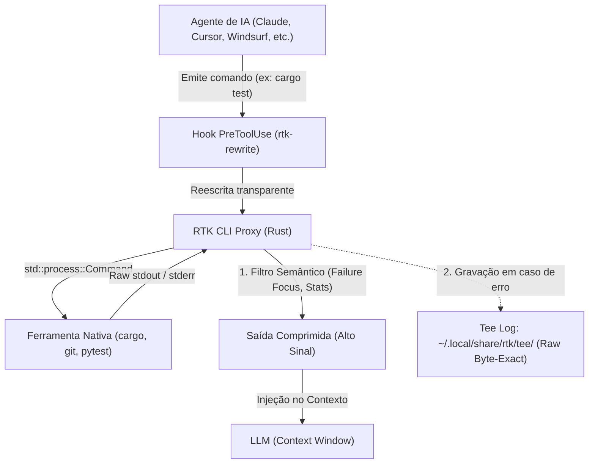

# RTK (Rust Token Killer) — Otimização e Filtragem de Saída CLI para Agentes de IA

## 📌 Resumo

O **RTK (Rust Token Killer)** ([rtk-ai/rtk](https://github.com/rtk-ai/rtk) / [rtk-ai.app](https://www.rtk-ai.app)) é uma ferramenta de proxy de terminal open-source (licença **Apache 2.0**) desenvolvida em Rust. Seu propósito é interceptar e comprimir a saída de comandos de linha de comando (`git`, `cargo test`, `pytest`, `npm test`, `eslint`, `docker`, etc.) antes que esses dados sejam injetados na janela de contexto de agentes de codificação (como Claude Code, Cursor, Cline, Windsurf, Gemini CLI, Google Antigravity e Copilot).

No [[adocao-de-ferramenta]], o RTK é classificado como **Otimização Operacional Ad-hoc (P2)**: reduz o consumo de tokens de entrada em rotinas repetitivas de terminal com overhead mínimo (<10ms) e reversibilidade total, mas não substitui uma boa gestão da arquitetura de contexto e histórico.

> 💡 **Analogia:** Um filtro de ruído inteligente em uma linha de transmissão. Em vez de transmitir centenas de mensagens de "teste passou com sucesso" e barras de progresso ANSI, o RTK transmite apenas o sumário estatístico e o relatório exato das falhas, mantendo o canal limpo para o raciocínio do modelo.

---

## 🧠 1. Arquitetura Técnica & Funcionamento de Baixo Nível

Diferente de wrappers pesados em Python ou Node.js, o RTK opera como um executável binário autônomo focado em performance:

* **Binário Único em Rust:** Zero dependências de runtime externas; inicialização e filtragem com overhead inferior a **10ms**.
* **Preservação Rígida de Exit Codes:** Propaga fielmente o código de saída (`exit code`) do comando original (`0`, `1`, `137`, etc.), garantindo que agentes e pipelines de CI tomem decisões corretas com base no sucesso ou falha da operação.
* **Degradação Suave (*Fail-Safe Fallback*):** Em caso de falhas no parser interno ou comandos não reconhecidos, o RTK repassa a saída original bruta (*raw output*) sem interromper o fluxo do agente.
* **Tracking Local com SQLite:** Registra métricas de bytes lidos e comprimidos em `~/.local/share/rtk/history.db` (consultáveis via `rtk gain`).



### Ciclo de Execução em 6 Fases

1. **Parse:** O parser baseado em `clap` extrai comando, argumentos e flags (`-v`, `--raw`).
2. **Route:** Roteamento interno para o módulo do ecossistema correspondente (Git, Rust, JS/TS, Python, Go, Cloud, System).
3. **Execute:** Executa o binário do sistema via `std::process::Command`.
4. **Filter:** Aplica heurísticas determinísticas e parsers semânticos sobre stdout e stderr.
5. **Print:** Emite a versão comprimida para o stdout lido pelo agente.
6. **Track:** Armazena os dados de redução no SQLite local para auditoria.

---

## 🧠 2. Recursos de Filtragem & Mecânica de Otimização

### Taxonomia de Estratégias por Domínio

O RTK implementa mais de 10 estratégias especializadas de compressão:

| Estratégia | Comandos Típicos | Mecânica Aplicada | Redução em Bash Output |
| :--- | :--- | :--- | :--- |
| **Failure Focus** | `cargo test`, `vitest`, `pytest`, `jest`, `playwright` | Oculta centenas de testes que passaram; exibe apenas testes com falha e seus traces essenciais. | **90% a 98%** |
| **Grouping by Pattern** | `eslint`, `tsc`, `ruff`, `mypy`, `golangci-lint` | Agrupa dezenas de erros repetidos por código de regra e arquivo em vez de listar linha a linha. | **80% a 90%** |
| **Stats Extraction** | `git status`, `git diff`, `git log`, `pnpm list` | Converte listas longas de arquivos e diffs em resumos compactos estruturados (`+142/-89`). | **85% a 99%** |
| **Progress Stripping** | `wget`, `curl`, `pnpm install`, `docker pull` | Remove sequências de escape ANSI e atualizações dinâmicas de barras de progresso. | **85% a 95%** |
| **Deduplication** | `log`, servidores web, saídas contínuas | Agrupa linhas de log idênticas com contadores numéricos `[ERROR] ... (x14)`. | **70% a 85%** |
| **Tree Compression** | `ls`, `tree`, `find` | Converte listagens planas de arquivos em árvores hierárquicas compactas com contadores. | **50% a 70%** |

### Reescrita Transparente (Hooks e Shims)

O RTK se integra via hooks de pré-execução de ferramentas (`PreToolUse`):
* O script hook lê o comando emitido pelo agente e invoca `rtk rewrite "<comando>"`.
* O analisador léxico do RTK decompõe comandos compostos (`&&`, `||`, `;`, pipes `|`, redirecionamentos `2>&1`).
* Comandos compatíveis são prefixados com `rtk` (ex: `git status` vira `rtk git status`), enquanto comandos não suportados ou pipes complexos passam intactos.
* O agente recebe o resultado sem precisar alterar seu próprio prompt ou raciocínio.

### Recuperação Exata (*Byte-Exact Recovery* via Tee System)

Para evitar que o modelo fique bloqueado por falta de detalhes em falhas complexas:
* O RTK grava a saída bruta completa em `~/.local/share/rtk/tee/<comando>_<timestamp>.log` quando um comando falha.
* O resumo enviado ao agente inclui uma referência: `Full output saved: ~/.local/share/rtk/tee/...`.
* Se o modelo necessitar do log completo, basta ler o arquivo gerado sem ter de reexecutar o comando.

---

## ⚖️ 3. Avaliação no Portão de Adoção

Aplicando os critérios de [[adocao-de-ferramenta]]:

### 1. Realidade Prática vs. Promessas de Marketing
* **Saída Bash vs. Fatura Total:** A redução de 60–90% divulgada pelo projeto refere-se **estritamente aos bytes de saída de comandos de terminal** (`bash output`).
* **Diluição de Custos:** Em uma sessão real de desenvolvimento com agentes, os tokens de saída de terminal representam apenas uma fração dos tokens de entrada (ao lado de arquivos lidos pelo agente, histórico de turnos acumulados, definições de ferramentas e system prompts).
* **Impacto Financeiro Real:** 
  - Em sessões focadas em **leitura de código e refatoração arquitetural**: economia de **5% a 20%** no custo total.
  - Em sessões de **TDD intensivo e resolução iterativa de testes/bugs**: economia de **30% a 50%** no custo total.

### 2. Riscos e Efeitos Colaterais
* **Mascaramento de Mensagens Críticas:** Em compiladores que utilizam mensagens em múltiplos níveis (ex: notas do `rustc` borrow-checker ou erros de templates C++), uma filtragem excessiva pode omitir a linha com a dica necessária para a correção.
* **Ferramentas Nativas Não Interceptadas:** As ferramentas internas do agente (como as tools nativas `Read`, `Grep` ou `Glob` do Claude Code/Cursor) não passam pelo hook de bash e, portanto, não são comprimidas a menos que o agente use comandos de terminal (`cat`, `rg`).

### 3. Comparativo: RTK vs. Caveman vs. Truncamento Nativo

| Critério | RTK (`rtk-ai/rtk`) | [[caveman]] (Skill & Proxy) | Truncamento Nativo do Agente |
| :--- | :--- | :--- | :--- |
| **Foco Principal** | **Tokens de Entrada** (Saída de ferramentas CLI) | **Tokens de Saída** (Estilo telegráfico de resposta) | **Proteção de Janela** (Evitar estouro de contexto) |
| **Camada** | Proxy CLI em Rust / Hooks de Terminal | System Prompt / Reverse Proxy HTTP | Engine interna do Agente |
| **Tipo de Corte** | **Semântico por domínio** (entende linters/testes) | **Linguístico** (remove cortesias e floreios) | **Cego / Rígido** (corta após N linhas/bytes) |
| **Recuperação** | Alta (Logs completos via subsistema `tee`) | Total (código e erros 100% byte-exact) | Nula (dados descartados) |
| **Sinergia** | Máxima quando combinado com [[caveman]] (RTK cuida do input CLI, Caveman cuida do output telegráfico). | | |

---

## 4. Veredito de Adoção

### Quando USAR
* **Sessões Autônomas de Testes e TDD:** Onde o agente executa `cargo test`, `pytest` ou `npm test` repetidamente.
* **Monorepos e Projetos com Linters Ruidosos:** Reduz centenas de linhas de advertências repetitivas de `eslint` ou `ruff`.
* **Sessões Longas de Terminal:** Mantém o contexto livre de poluição ANSI e logs redundantes, preservando a atenção do modelo.

### Quando NÃO USAR
* **Depuração de Problemas de Compilação Extremamente Sutis:** Onde mensagens secundárias de compiladores esotéricos são indispensáveis no primeiro turno.
* **Agentes Restritos a Ferramentas Internas Sem Acesso a Terminal:** Onde todo acesso ao código é feito via APIs internas indexadas.
* **Ambientes Corporativos com Proibição de Hooks Locais:** Ambientes com auditoria estrita de processos no terminal.

---

## 🔄 5. Desambiguação Técnica

Não confundir o **RTK (Rust Token Killer)** com outros homônimos:

1. **Redux Toolkit (RTK) & RTK Query:** Biblioteca padrão para gerenciamento de estado global e data fetching no ecossistema JavaScript / React.
2. **`rtk` (Rust Type Kit no crates.io):** Crate Rust não relacionada que causa colisão de nomes no comando `cargo install`.
3. **RTK (Real-Time Kinematics):** Técnica de posicionamento por satélite de alta precisão utilizada em agrimensura, drones e robótica (GNSS).

---

## 🛠️ 6. Instalação e Configuração Rápida

### Instalação

```bash
# 1. Via Homebrew (macOS / Linux - Recomendado)
brew install rtk

# 2. Via Script de Instalação Rápida
curl -fsSL https://raw.githubusercontent.com/rtk-ai/rtk/refs/heads/master/install.sh | sh

# 3. Via Cargo (Obrigatório usar --git para evitar colisão com o crates.io)
cargo install --git https://github.com/rtk-ai/rtk
```

### Ativação nos Agentes

```bash
# Claude Code / GitHub Copilot
rtk init -g

# Cursor
rtk init -g --agent cursor

# Windsurf
rtk init -g --agent windsurf

# Cline / Roo Code
rtk init --agent cline

# Google Antigravity
rtk init --agent antigravity
```

### Comandos de Diagnóstico

```bash
rtk --version   # Checagem de versão
rtk gain        # Painel de economia de tokens
rtk gain --history # Histórico de execuções registradas no SQLite
```

---

## 🔗 Ver também

* [[adocao-de-ferramenta]] — portão de adoção e critérios de avaliação de ferramentas.
* [[caveman]] — compressão telegráfica de saída e proxy de eficiência para agentes.
* [[ponytail]] — engenharia minimalista e prevenção de over-engineering para agentes.
* [[find-skills]] — riscos de inchaço de contexto e governança de capacidades.
* [[agent-browser]] — automação e navegação otimizada para agentes.
* [[prompt-engineering]] — fundamentos de clareza e controle de contexto em LLMs.
* [[global-rules]] — regras de comportamento e concisão para agentes no vault.

---

## 📚 Fontes

* [Repositório Oficial rtk-ai/rtk](https://github.com/rtk-ai/rtk) — Código-fonte, issues e documentação oficial.
* [Portal Oficial RTK](https://www.rtk-ai.app) — Documentação e guia de uso.
* [Documentação de Arquitetura do RTK](https://github.com/rtk-ai/rtk/blob/master/docs/contributing/ARCHITECTURE.md) — Detalhes internos de execução e filtros.
* [Explicação sobre Economia de Tokens](https://github.com/rtk-ai/rtk/blob/master/docs/guide/resources/savings-explained.md) — Metodologia de mensuração de tokens e custos.
